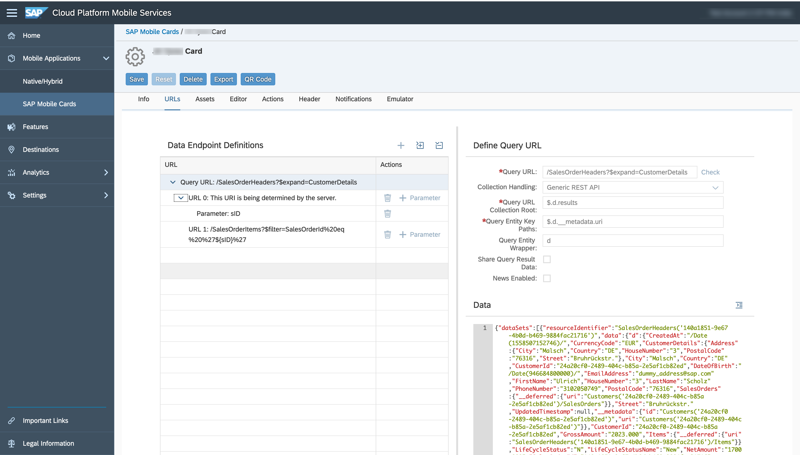
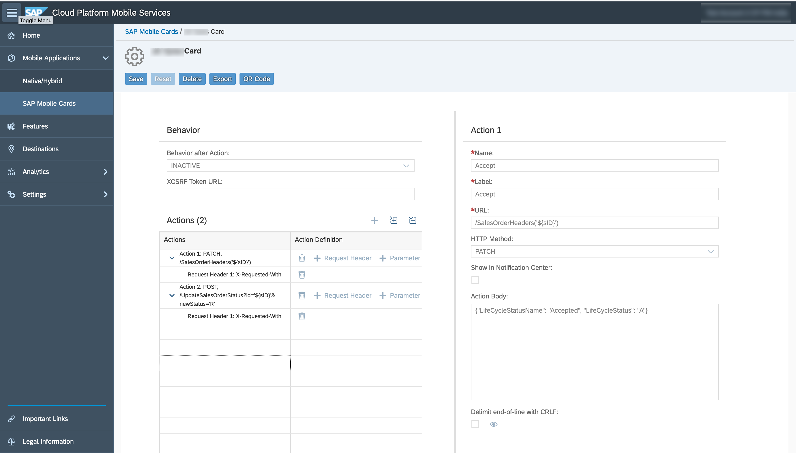

# URLs Used

1. Base URL - `/SalesOrderHeaders?$expand=CustomerDetails`
2. Parameter - `sID`
3. URL 2 - `/SalesOrderItems?$filter=SalesOrderId%20eq%20%27${sID}%27`



# Actions

## Accept Action
|Field|Value|
| -- |------|
|Name|Accept|
|Label|	Accept|
|URL|	`/SalesOrderHeaders('${SalesOrderId}')`|
|HTTP Method|	PATCH|
|Action Body|	```{"LifeCycleStatusName": "Accepted", "LifeCycleStatus": "A"}```|

Request Header

|X-Requested-With|	XMLHttpRequest|
| -- |------|


## Reject Action
|Field|Value|
| -- |------|
|Name|Accept|
|Label|	Accept|
|URL|	`/UpdateSalesOrderStatus?id='${SalesOrderId}'&newStatus='R'`|
|HTTP Method|	POST|

Request Header

|X-Requested-With|	XMLHttpRequest|
| -- |------|

